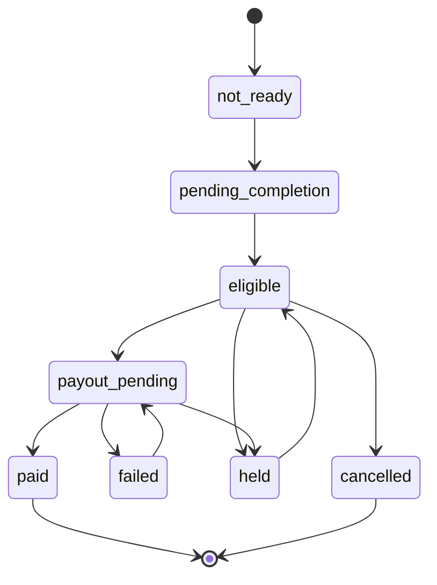

# Zivo Business Payout Flow

Status: Draft for owner review · Date: 2026-06-07

See [`PAYMENT_ARCHITECTURE.md`](PAYMENT_ARCHITECTURE.md) for the ZivoPay provider-adapter
model and [`DRIVER_PAYOUT_FLOW.md`](DRIVER_PAYOUT_FLOW.md) for the parallel driver case.

Business payouts are required. A business earns money through ZIVO (customer payments,
marketplace orders, bookings, software-resale revenue share, invoices) and ZivoPay pays the
business its balance, minus platform fees. Like driver payouts, a paid customer transaction
does **not** automatically mean a business can be paid.

> **Confirmed (2026-06-07):** payout records live in the **hub** ZivoPay database
> (`slirphzzwcogdbkeicff`). Business has no separate Supabase project.

---

## 1. Payout preconditions

- The underlying customer payment(s) are `paid`.
- The earning is attributable to a `business_id` and `zivosmedia_user_id`.
- The order/booking/subscription period is completed (service delivered).
- Refund/dispute window rules are satisfied for the source type.
- Admin/system marks the payout `eligible`.
- The business has a valid payout profile.
- If using Stripe, the business has a valid Stripe Connect account with payout capability;
  PayPal Payouts or Square are alternative adapters.

---

## 2. Ledger fields

`business_payouts` stores:

- `business_id`
- `zivosmedia_user_id`
- `source_type` (`marketplace_order`, `booking`, `software_revenue_share`, `invoice`, `manual`)
- `source_record_id`
- `provider` (`stripe` | `paypal` | `square`)
- `provider_connected_account_id`
- `provider_payout_id`
- `gross_amount`
- `platform_fee`
- `business_earning`
- `currency`
- `status`
- `available_at`
- `paid_at`
- `created_at` / `updated_at`

---

## 3. Status flow

1. `not_ready` — source order/payment not ready.
2. `pending_completion` — payment exists, waiting for delivery/period completion.
3. `eligible` — completed and approved for payout.
4. `payout_pending` — provider transfer/payout requested.
5. `paid` — provider confirms payout.
6. `failed` — provider failed payout.
7. `held` — admin or risk system holds payout.
8. `cancelled` — payout no longer valid.

---

## 4. Admin controls

Zivo Admin can: hold payout, release payout, mark a manual payout paid, retry a failed
payout, inspect related customer payments, inspect refunds/disputes before release, and view
the business payout audit log. See [`ADMIN_DASHBOARD_PLAN.md`](ADMIN_DASHBOARD_PLAN.md).

---

## 5. APIs & webhooks

Full conventions live in [`API_WEBHOOK_CONTRACT.md`](API_WEBHOOK_CONTRACT.md).

- `POST /api/business/create-payout-account` → onboarding to the chosen provider adapter
- `GET  /api/business/:business_id/earnings`
- `GET  /api/business/:business_id/payouts`
- `POST /webhooks/payments/business-payout-paid`
- `POST /webhooks/payments/business-payout-failed`

---

## 6. Safety

- Provider adapters are implemented Stripe-first, then PayPal, then Square.
- **No live payout creation** until sandbox/test mode passes and the owner approves a
  marketplace payout provider.
- No card numbers stored; no provider secret keys or Supabase service-role keys exposed;
  payouts executed only via server-side routes / Supabase Edge Functions. See
  [`SECURITY_CHECKLIST.md`](SECURITY_CHECKLIST.md).
