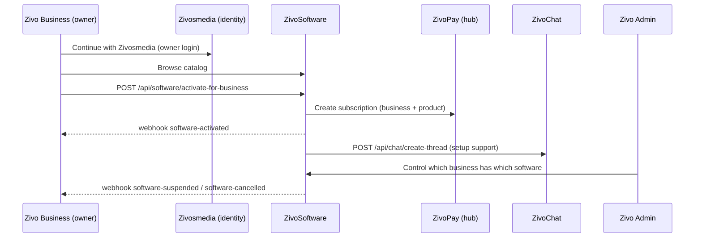
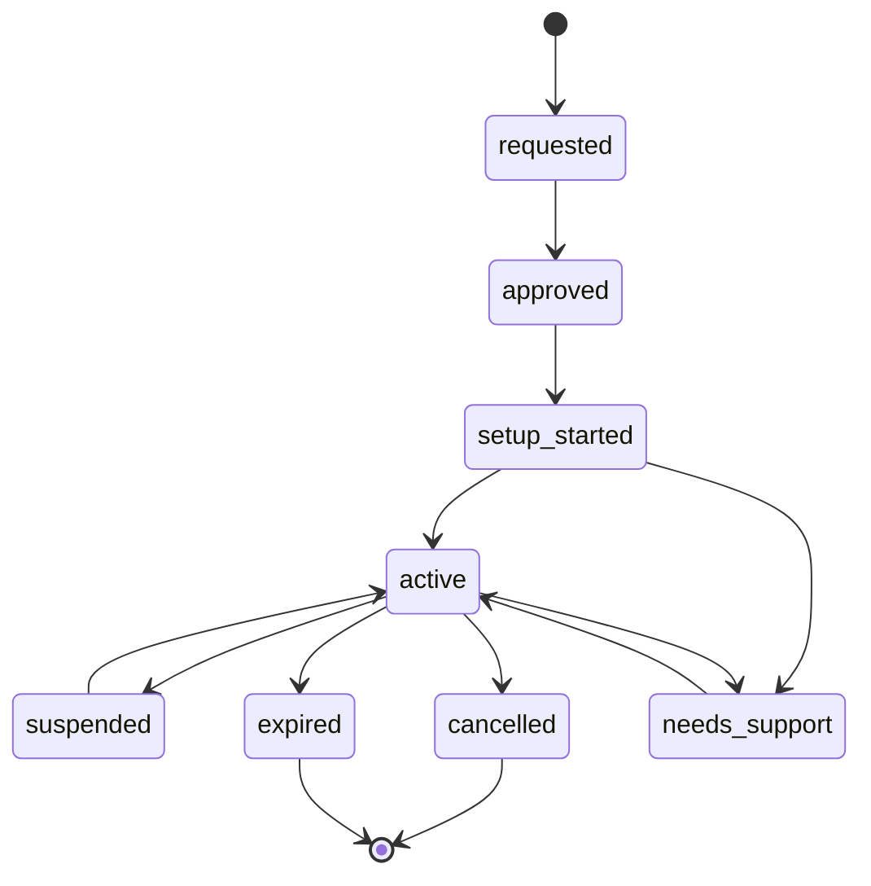

# Zivo Business ↔ ZivoSoftware Flow

Status: Draft for owner review · Date: 2026-06-07

See [`PLATFORM_RELATIONSHIPS.md`](PLATFORM_RELATIONSHIPS.md) for the umbrella model and
[`REPO_INVENTORY.md`](REPO_INVENTORY.md) for current state.

**ZivoSoftware is the platform for business software products.** It is the catalog;
**Zivo Business** is where a business manages its profile and decides which software to run.
A business activates software from ZivoSoftware, Zivo Admin controls subscriptions, ZivoChat
supports setup, and payment connects to the software subscription and the business profile —
all linked through the Zivosmedia account.

> **Confirmed (2026-06-07):** Zivo Business is **not its own repo or Supabase project**. Its
> backend lives in the ZivoSoftware project (`ydxztoresbdeoeijhxww`); its owner-facing UI is
> served by the `zivosmedia` build. A standalone repo is only needed if Business later needs
> an independent runtime.

---

## 1. ZivoSoftware catalog

ZivoSoftware should include all types of business software, for example: business website,
booking, **POS**, **CRM**, employee management, **payroll**, restaurant, **travel agency**,
**driver / fleet**, chat / support, **AI assistant**, e-commerce, **invoice / payment**,
**marketing**, and **custom** business software.

---

## 2. Example flow

1. A business creates or manages its profile in **Zivo Business**.
2. The business owner logs in with **Zivosmedia** (Continue with Zivosmedia).
3. The business views and **activates** software from **ZivoSoftware**.
4. **Zivo Admin** controls which business has which software (subscriptions).
5. **ZivoChat** supports the business during setup.
6. Payment connects to the software subscription and the business profile (ZivoPay hub).

---

## 3. Business ↔ software record (the join contract)

A business-software subscription record should carry these fields (**target** contract):

| Field | Meaning |
| --- | --- |
| `business_id` | The Zivo Business profile. |
| `zivosmedia_user_id` | Universal identity join key for the owner/operator. |
| `software_product_id` | The ZivoSoftware product. |
| `subscription_id` | The subscription instance (ZivoPay). |
| `business_owner_id` | Local owner id on the business side. |
| `status` | Lifecycle state (see below). |
| `plan` | Selected plan/tier. |
| `payment_subscription_id` | ZivoPay subscription on the hub. |
| `billing_status` | Billing state (payment authority is the Zivosmedia hub). |
| `setup_status` | Onboarding/installation progress. |
| `chat_thread_id` | Linked ZivoChat setup-support thread, if any. |
| `created_at` / `updated_at` | Timestamps. |

---

## 4. Status lifecycle

`requested` → `approved` → `setup_started` → `active`

Ongoing / terminal states: `suspended`, `cancelled`, `expired`, `needs_support`.

---

## 5. API & webhook endpoints

Full conventions live in [`API_WEBHOOK_CONTRACT.md`](API_WEBHOOK_CONTRACT.md).

**Zivo Business → ZivoSoftware**

- `POST /api/software/activate-for-business`
- `GET  /api/software/business/:business_id/subscriptions`

**ZivoSoftware → Zivo Business**

- `POST /webhooks/business/software-activated`
- `POST /webhooks/business/software-suspended`
- `POST /webhooks/business/software-cancelled`

Business revenue earned through software/marketplace flows is paid out via
[`BUSINESS_PAYOUT_FLOW.md`](BUSINESS_PAYOUT_FLOW.md).

---

## 6. ZivoChat & Zivo Admin touchpoints

- **ZivoChat**: software setup opens a support thread (`source_platform = zivosoftware` or
  `zivo_business`) carrying `business_id` and `software_product_id`. See
  [`ZIVOCHAT_FLOW.md`](ZIVOCHAT_FLOW.md).
- **Zivo Admin**: the dashboard must show *which business owns which software* and let staff
  manage subscriptions, by following `business_id` ↔ `software_product_id` ↔ `subscription_id`
  ↔ `zivosmedia_user_id`. See [`ADMIN_DASHBOARD_PLAN.md`](ADMIN_DASHBOARD_PLAN.md).

---

## 7. Current state vs. target

- `zivosoftware` (`ydxztoresbdeoeijhxww`) is currently a **backend/docs + migrations repo,
  with no standalone frontend**. The live `zivosoftware.com` and business experience is served
  by the `zivosmedia` build (business/software routes live inside zivosmedia today).
- The subscription/activation backend already partially **exists** — `software_products`,
  `software_pricing_plans`, `business_software_entitlements`, and `payment_subscriptions` (in
  the hub) plus activation edge functions. Open gaps: the **owner-facing UI** and reconciling
  the subscription vs. store-onboarding lifecycles.
- Building this is **Step 6** of the build order, subject to the safety guardrails in
  [`SECURITY_CHECKLIST.md`](SECURITY_CHECKLIST.md).
