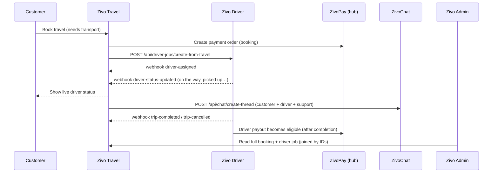
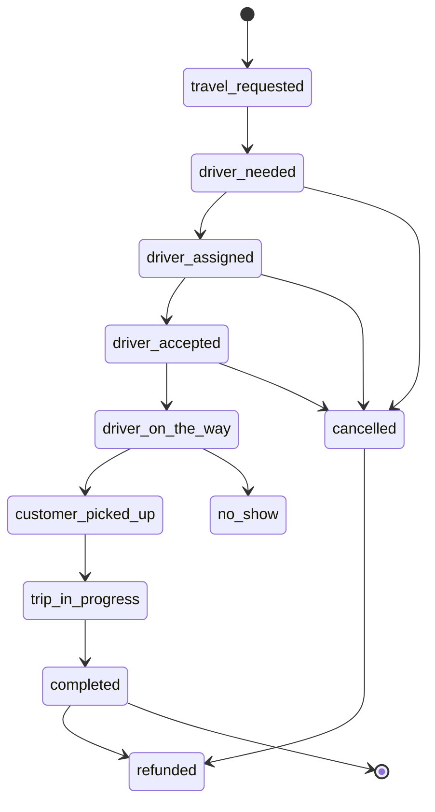

# Zivo Travel ↔ Zivo Driver Flow

Status: Draft for owner review · Date: 2026-06-07

See [`PLATFORM_RELATIONSHIPS.md`](PLATFORM_RELATIONSHIPS.md) for the umbrella model and
[`REPO_INVENTORY.md`](REPO_INVENTORY.md) for current state.

**Zivo Driver is not a standalone island.** When a travel booking needs transport (a driver,
car, pickup, airport transfer, delivery, tour driver, or local transport), Zivo Travel hands
the request to Zivo Driver, and Zivo Driver reports status back so the customer, Zivo Admin,
and ZivoChat all see one connected operation. Payment connects to the booking and the driver
job; the driver payout happens only after the job is completed.

---

## 1. Example flow

1. Customer books travel in **Zivo Travel**.
2. If the booking needs transport, **Zivo Travel** creates a **Zivo Driver** job.
3. **Zivo Driver** can **accept**, **reject**, or **update status**.
4. **Zivo Driver** status syncs back to **Zivo Travel**.
5. The customer can see the driver status.
6. **Zivo Admin** sees the full booking + driver job together.
7. **ZivoChat** can open a customer ↔ driver ↔ support thread.
8. Payment connects to the booking and the driver job; the **driver payout** happens after
   the completed job (see [`DRIVER_PAYOUT_FLOW.md`](DRIVER_PAYOUT_FLOW.md)).

---

## 2. Shared integration record (the join contract)

The link between a `travel_booking` (Travel project `xbllvmpomorawkcrtbcq`) and a
`driver_job` (Driver project `yiedlgoxwjmansszdypf`) should carry these fields. This is the
**target** contract.

| Field | Meaning |
| --- | --- |
| `travel_booking_id` | The originating Zivo Travel booking. |
| `driver_job_id` | The Zivo Driver job created for it. |
| `zivosmedia_user_id` | Universal identity join key for the customer. |
| `customer_id` | Local customer id on Travel/Driver. |
| `driver_id` | Assigned driver. |
| `pickup_location` | Pickup point. |
| `dropoff_location` | Drop-off point. |
| `scheduled_time` | Requested pickup / service time. |
| `trip_status` | Travel-side view of the trip (see lifecycle). |
| `driver_status` | Driver-side view of the trip (see lifecycle). |
| `payment_order_id` | ZivoPay order on the hub (`slirphzzwcogdbkeicff`). |
| `payment_status` | Payment state (payment authority is the Zivosmedia hub). |
| `chat_thread_id` | Linked ZivoChat thread, if any. |
| `created_at` / `updated_at` | Timestamps. |

---

## 3. Status lifecycle

`trip_status` and `driver_status` are tracked separately but move through a shared vocabulary:

`travel_requested` → `driver_needed` → `driver_assigned` → `driver_accepted` →
`driver_on_the_way` → `customer_picked_up` → `trip_in_progress` → `completed`

Terminal / exception states: `cancelled`, `no_show`, `refunded`.

---

## 4. API & webhook endpoints

Full conventions (auth, signing, idempotency) live in
[`API_WEBHOOK_CONTRACT.md`](API_WEBHOOK_CONTRACT.md).

**Zivo Travel → Zivo Driver**

- `POST /api/driver-jobs/create-from-travel`
- `GET  /api/driver-jobs/by-travel-booking/:travel_booking_id`

**Zivo Driver → Zivo Travel**

- `POST /webhooks/travel/driver-assigned`
- `POST /webhooks/travel/driver-status-updated`
- `POST /webhooks/travel/trip-completed`
- `POST /webhooks/travel/trip-cancelled`

---

## 5. ZivoChat & Zivo Admin touchpoints

- **ZivoChat**: a trip can open a thread (`source_platform = zivo_travel` or `zivo_driver`)
  carrying both `travel_booking_id` and `driver_job_id` so support sees full context. See
  [`ZIVOCHAT_FLOW.md`](ZIVOCHAT_FLOW.md).
- **Zivo Admin**: the dashboard must show *which travel booking created which driver job* and
  *which driver is assigned to which booking*, by following `travel_booking_id` ↔
  `driver_job_id` ↔ `zivosmedia_user_id`. See [`ADMIN_DASHBOARD_PLAN.md`](ADMIN_DASHBOARD_PLAN.md).

---

## 6. Current state vs. target

- Zivo Travel runs in **bridge mode** today: auth/checkout/wallet/payouts stay on the
  Zivosmedia hub; the Travel project (`xbllvmpomorawkcrtbcq`) holds foundation tables and a
  Cloudflare Worker exposing `/api/health` and bridge endpoints. There is no
  `create-from-travel` endpoint yet.
- Zivo Driver (`yiedlgoxwjmansszdypf`) has a real app + `drivers` table and edge functions
  (`driver-me`, `driver-go-online`, `location-heartbeat`, …) but no travel-job intake. A
  "driver job" maps to a row in Driver's live **`public.trips`** table (there is no
  `driver_job` table yet).
- The join record above does **not** exist yet. Building this is **Step 3** of the build
  order and must follow the safety guardrails (feature branch, no destructive migration,
  owner approval before schema changes). See [`SECURITY_CHECKLIST.md`](SECURITY_CHECKLIST.md).
