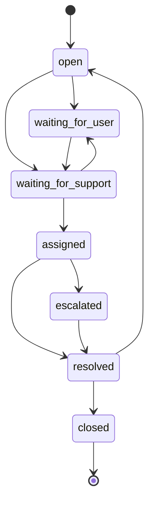

# ZivoChat Flow

Status: Draft for owner review · Date: 2026-06-07

See [`PLATFORM_RELATIONSHIPS.md`](PLATFORM_RELATIONSHIPS.md) for the umbrella model and
[`REPO_INVENTORY.md`](REPO_INVENTORY.md) for current state.

**ZivoChat is the shared communication layer for the full ZIVO ecosystem.** It is not a
separate silo — any platform can open a chat thread, and every thread knows which app it came
from, which record it relates to, and which Zivosmedia identity it belongs to.

> **Confirmed (2026-06-07):** ZivoChat has **no separate Supabase project**. It runs on the
> **hub** project `slirphzzwcogdbkeicff`, which is why hub edge functions (e.g.
> `mint-chat-handoff`) work for chat today.

---

## 1. Conversation types ZivoChat must support

- Customer ↔ support
- Customer ↔ driver
- Business owner ↔ Zivo support
- Travel-booking chat
- Software-setup chat
- Admin ↔ user / Admin ↔ driver / Admin ↔ business
- App-specific chat connected to the Zivosmedia user identity

---

## 2. Chat thread schema (the join contract)

Every thread should know (**target** contract — matches the owner's required fields):

| Field | Meaning |
| --- | --- |
| `chat_thread_id` | The thread's own id. |
| `source_platform` | Platform the thread originated from (`zivo_travel`, `zivo_driver`, `zivosoftware`, `zivo_business`, `zivo_admin`, `zivosmedia`). |
| `app_key` | Stable key of the app that owns/opened the thread. |
| `zivosmedia_user_id` | Universal identity join key for the primary user. |
| `local_user_id` | The user's id on the source platform. |
| `business_id` | Related business, if any. |
| `travel_booking_id` | Related travel booking, if any. |
| `driver_job_id` | Related driver job, if any. |
| `software_product_id` | Related software product, if any. |
| `payment_id` | Related ZivoPay record, if any. |
| `participants` | Everyone in the thread (customer, driver, support, admin…). |
| `status` | Lifecycle state (see below). |
| `priority` | Triage priority. |
| `assigned_admin_id` | Staff member handling it, if assigned. |
| `created_at` / `updated_at` | Timestamps. |

The related-record foreign keys let one thread sit on top of a Travel + Driver trip, a
Business + Software subscription, or a payment — and let Zivo Admin answer "which chat thread
belongs to which record".

---

## 3. Status lifecycle

`open` → `waiting_for_user` / `waiting_for_support` → `assigned` → `escalated` → `resolved` →
`closed`

---

## 4. API & webhook endpoints

Full conventions live in [`API_WEBHOOK_CONTRACT.md`](API_WEBHOOK_CONTRACT.md).

**ZivoChat ↔ all apps**

- `POST /api/chat/create-thread`
- `POST /api/chat/add-message`
- `GET  /api/chat/thread/:chat_thread_id`
- `POST /webhooks/chat/thread-updated`
- `POST /webhooks/chat/thread-resolved`

Any platform calls `create-thread` with the relevant record IDs; ZivoChat emits
`thread-updated` / `thread-resolved` back to the source platform and to Zivo Admin.

---

## 5. Identity binding

Every chat thread is tied to a `zivosmedia_user_id` for the primary user, alongside the
`local_user_id` on the source platform. This keeps conversations attributable to one human
across apps and lets Zivo Admin see all of a user's threads regardless of which platform
opened them. See [`AUTH_AND_IDENTITY_FLOW.md`](AUTH_AND_IDENTITY_FLOW.md).

---

## 6. Current state vs. target

- ZivoChat (`ZIVO-CHAT` repo) is a real Vite/React/Capacitor app that **shares the hub
  Supabase project** (`slirphzzwcogdbkeicff`).
- A `startZivoConnect` helper and ZIVO connect login/signup buttons already exist.
  `useCrossAppAuth.ts` currently calls a browser `exchange-auth-token` with `{token}` and
  treats its 404 as "not wired yet"; per the 2026-06-07 identity decision this is rewired to a
  ZivoChat **server** exchange endpoint that calls the hub `zivosmedia-auth-validate-code`. See
  [`AUTH_AND_IDENTITY_FLOW.md`](AUTH_AND_IDENTITY_FLOW.md).
- The unified thread schema above is **target**. There is **no `chat_threads`/`conversations`
  table** yet (peer chat is threadless via `direct_messages`); a payment-scoped
  `payment_support_threads` with this cross-platform shape already exists. **Step 4** of the
  build order introduces the missing thread primitive and generalizes from it, subject to the
  safety guardrails in [`SECURITY_CHECKLIST.md`](SECURITY_CHECKLIST.md).
