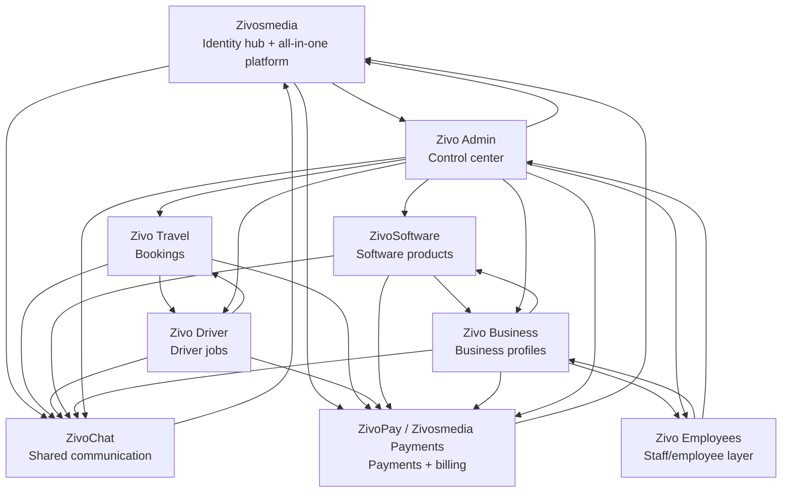

# ZIVO Ecosystem Map

Status: Draft for owner review
Date: 2026-06-07
Owner: ZIVO LLC

## Purpose

This document maps the full ZIVO LLC ecosystem before implementation. It is the first source of truth for how Zivosmedia, Zivo Admin, ZivoChat, Zivo Travel, Zivo Driver, ZivoSoftware, Zivo Business, Zivo Employees, and ZivoPay / Zivosmedia Payments should connect.

No production DNS, secrets, database schema, auth settings, or deployment settings should be changed from this document alone.

## Platform Roles

| Platform | Role | Current owner/source of truth | Notes |
| --- | --- | --- | --- |
| Zivosmedia | Main all-in-one platform, central identity hub, central payment hub | `kimlainchhorng/zivosmedia`; `zivosmedia.com` | Canonical `zivosmedia_user_id`, central login, payments/wallet entry point, app switcher. |
| Zivo Admin | Staff-only control center | `kimlainchhorng/Zivo-Admin`; `zivoadmin.com` | Platform registry, health, users, bookings, driver jobs, business/software, chat, payments, audit. |
| ZivosChat | Shared communication layer | `kimlainchhorng/ZIVO-CHAT`; `zivoschat.com` | Cross-app chat threads tied to app keys, users, and related records. |
| Zivo Travel | Travel booking platform | `kimlainchhorng/zivostravel`; `zivostravel.com` | Flights, hotels, cars, buses, booking support, travel checkout handoff. |
| Zivo Driver | Driver platform | `kimlainchhorng/zivodriver`; `zivodriver.com` | Driver onboarding, driver jobs, status, payouts, customer pickup/delivery work. |
| ZivoSoftware | Business software platform | `kimlainchhorng/zivosoftware`; `zivosoftware.com` | Business software products, subscriptions, tenant/category/compliance operations. |
| Zivo Business | Business ownership layer | Repo needs confirmation/creation; `zivobusiness.com` | Business profiles, billing ownership, software activation, employee ownership. |
| Zivo Employee | Employee/staff layer | Repo needs confirmation/creation; `zivoemployee.com` | Employee profiles, schedules, staff permissions, business/admin workflows. |
| ZivoPay / Zivosmedia Payments | Shared payment system | Zivosmedia central payment hub | Stripe first, then PayPal and Square provider adapters; payments, subscriptions, invoices, refunds, disputes, driver/business payouts. |

## High-Level Connections

## Identity Rule

Every important user record should be linkable to `zivosmedia_user_id`.

Apps may keep local users and app-specific profiles, but each app must support:

- Continue with Zivosmedia.
- Server-side auth code/token exchange.
- Local profile linking.
- User update/disabled webhooks from Zivosmedia.
- Audit logs for auth and linking events.

## Payment Rule

All payment records should be traceable to:

- `zivosmedia_user_id`
- `source_platform`
- source record ID, such as booking, driver job, business, software subscription, invoice, or chat ticket
- payment provider object ID, such as Stripe checkout session, payment intent, invoice, refund, dispute, or transfer

ZivoPay is the shared Zivosmedia Payments layer. It should use one common payment abstraction with provider adapters, not separate payment logic in each app.

## Admin Rule

Zivo Admin is the visibility and control layer. It should read or act through server-side APIs only. It must not expose service-role keys, Stripe secrets, Cloudflare tokens, or private database joins to browser code.
